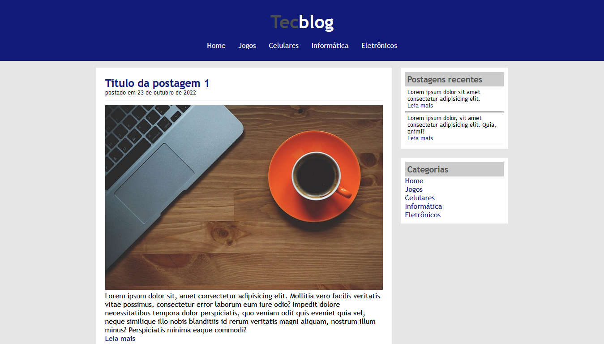

# Tecblog

Projeto construído no site Udemy - Desenvolvimento Web Completo 2022

[Clique aqui para acessar](https://jonathandscoutinho.github.io/udemy-tecblog/)

### Languages and Tools:
<code></code>
<code></code>
<code></code>

  
### Contato:

 
 
  
    
  

